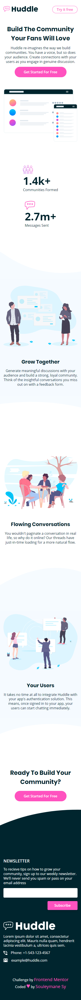
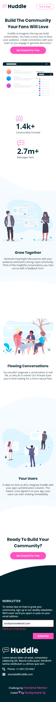
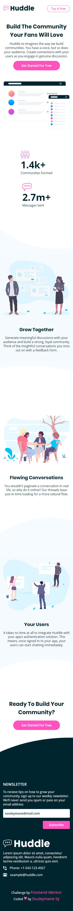
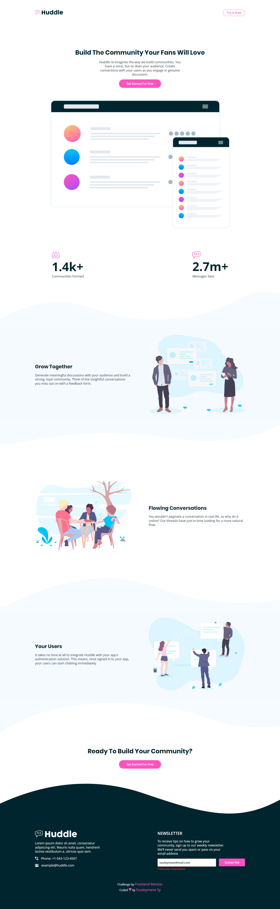

# Frontend Mentor - Huddle landing page with curved sections

## Welcome! 👋

This is a solution to the [Huddle landing page with curved sections challenge on Frontend Mentor](https://www.frontendmentor.io/challenges/huddle-landing-page-with-curved-sections-5ca5ecd01e82137ec91a50f2).

[Frontend Mentor](https://www.frontendmentor.io) challenges help you improve your coding skills by building realistic projects.

## Table of contents

- [The challenge](#the-challenge)
- [Screenshot](#screenshot)
- [Built with](#built-with)
- [Links](#links)
- [Author](#author)

## The challenge

The challenge is to build out this landing page and get it looking as close to the design as possible.

Users should be able to:

- View the optimal layout for the site depending on their device's screen size
- See hover states for all interactive elements on the page

## Screenshot

This is the Screenshot of my work!

### Mobile

### Mobile Form Errors

### Mobile Form Success

### Desktop

### Desktop Form Errors

### Desktop Form Success

### Built with

- Semantic HTML5 markup
- SASS
- CSS custom properties
- Flexbox
- CSS Grid
- Mobile-first workflow
- Yarn
- Vite
- Vue Js
- Compositon API

### Links

- Solution URL: [Add solution URL here](https://your-solution-url.com)
- Live Site URL: [Add live site URL here](https://your-live-site-url.com)

## Author

- GitHub - [Souleymane Sy](https://github.com/SouleymaneSy7)
- Frontend Mentor - [@SouleymaneSy7](https://www.frontendmentor.io/profile/SouleymaneSy7)
- Twitter - [@Souleymanesy43](https://twitter.com/Souleymanesy43)
